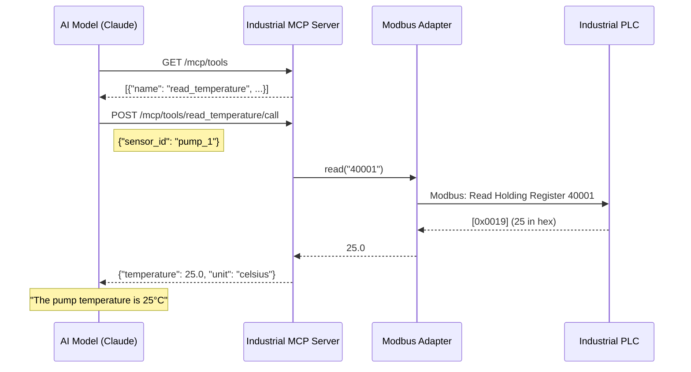

# Industrial MCP Architecture 
# 工业 MCP 架构说明

[English](#english) | [中文](#中文)

---

<a name="english"></a>

## Overview

**Industrial MCP** is a server implementation of the [Model Context Protocol (MCP)](https://modelcontextprotocol.io/) designed specifically for industrial environments. It acts as a **bridge** between AI models (like Claude, GPT, or local LLMs) and industrial equipment (PLCs, sensors, actuators).

```
┌─────────────────┐    MCP Protocol    ┌─────────────────────┐    Industrial    ┌─────────────────┐
│   AI Client     │◄──────────────────►│  Industrial MCP     │◄────────────────►│   Equipment     │
│  (Claude, GPT)  │    HTTP/JSON       │      Server         │    Protocols     │  (PLC, Sensors) │
└─────────────────┘                    └─────────────────────┘                  └─────────────────┘
```

## What is MCP?

**Model Context Protocol (MCP)** is an open standard that allows AI models to:

1. **Discover Tools** - Find out what actions they can perform
2. **Call Tools** - Execute actions in the real world
3. **Access Resources** - Read data and context

Think of MCP as **"USB for AI"** - just like USB provides a universal way for peripherals to connect to computers, MCP provides a universal way for AI models to connect to external systems.

## How Industrial MCP Works

### 1. The Server

The `MCPServer` class is the heart of the system:

```python
from industrial_mcp import MCPServer

server = MCPServer(name="my-factory", port=8080)
```

When started, it exposes these HTTP endpoints:

| Endpoint | Method | Description |
|----------|--------|-------------|
| `/` | GET | Server info and status |
| `/mcp/tools` | GET | List all available tools |
| `/mcp/tools/{name}/call` | POST | Execute a specific tool |
| `/mcp/resources` | GET | List available data resources |
| `/mcp/resources/{uri}` | GET | Read a specific resource |

### 2. Registering Tools

Tools are functions that AI can call. Use the `@server.tool()` decorator:

```python
@server.tool("read_temperature")
async def read_temperature(sensor_id: str):
    """Read temperature from a sensor."""
    # Connect to actual hardware here
    return {"sensor_id": sensor_id, "temperature": 25.5, "unit": "celsius"}
```

When an AI client calls `read_temperature`, the server:
1. Receives the request with parameters
2. Executes the Python function
3. Returns the result as JSON

### 3. Protocol Adapters

Industrial equipment speaks many different protocols. Adapters translate between them:

```
┌─────────────────────────────────────────────────────────────────┐
│                      Industrial MCP Server                       │
├─────────────────────────────────────────────────────────────────┤
│                                                                  │
│   ┌──────────────┐  ┌──────────────┐  ┌──────────────┐          │
│   │   Modbus     │  │   OPC UA     │  │    MQTT      │          │
│   │   Adapter    │  │   Adapter    │  │   Adapter    │          │
│   └──────┬───────┘  └──────┬───────┘  └──────┬───────┘          │
│          │                 │                 │                   │
└──────────┼─────────────────┼─────────────────┼───────────────────┘
           │                 │                 │
           ▼                 ▼                 ▼
    ┌──────────────┐  ┌──────────────┐  ┌──────────────┐
    │  Modbus PLC  │  │  OPC UA      │  │  MQTT        │
    │  (Siemens,   │  │  Server      │  │  Broker      │
    │   Schneider) │  │  (Industry)  │  │  (IoT)       │
    └──────────────┘  └──────────────┘  └──────────────┘
```

Each adapter implements a common interface:

```python
class BaseAdapter(ABC):
    async def connect(self) -> bool
    async def disconnect(self) -> None
    async def read(self, address: str) -> Any
    async def write(self, address: str, value: Any) -> bool
```

### 4. Complete Data Flow

Here's what happens when an AI asks "What's the pump temperature?":



## Key Design Decisions

### Why Python?

1. **Rapid Prototyping** - Quick iteration during development
2. **Rich Ecosystem** - Libraries for every industrial protocol
3. **AI Integration** - First-class support in AI frameworks
4. **Edge Deployment** - Runs on Raspberry Pi, Jetson, etc.

### Why FastAPI?

1. **Async Native** - Non-blocking I/O for real-time systems
2. **Auto Documentation** - OpenAPI/Swagger built-in
3. **Type Safety** - Pydantic validation
4. **Performance** - One of the fastest Python frameworks

### Why Modular Adapters?

1. **Extensibility** - Add new protocols without changing core
2. **Testability** - Mock adapters for unit testing
3. **Separation of Concerns** - Protocol logic isolated from MCP logic

## Deployment Scenarios

### Scenario 1: Single Machine

```
┌─────────────────────────────────────────┐
│           Raspberry Pi / Edge PC         │
│  ┌─────────────────────────────────────┐ │
│  │       Industrial MCP Server          │ │
│  │  ┌────────┐ ┌────────┐ ┌────────┐   │ │
│  │  │Modbus  │ │OPC UA  │ │ MQTT   │   │ │
│  │  │Adapter │ │Adapter │ │Adapter │   │ │
│  │  └────────┘ └────────┘ └────────┘   │ │
│  └─────────────────────────────────────┘ │
└────────────────────┬────────────────────┘
                     │ Modbus/OPC UA/MQTT
              ┌──────┴──────┐
              │  Factory    │
              │  Equipment  │
              └─────────────┘
```

### Scenario 2: Multi-Site with Cloud

```
┌─────────────┐    ┌─────────────┐    ┌─────────────┐
│  Factory A  │    │  Factory B  │    │  Factory C  │
│  (Paris)    │    │  (Lyon)     │    │  (Marseille)│
│ ┌─────────┐ │    │ ┌─────────┐ │    │ ┌─────────┐ │
│ │MCP Node │ │    │ │MCP Node │ │    │ │MCP Node │ │
│ └────┬────┘ │    │ └────┬────┘ │    │ └────┬────┘ │
└──────┼──────┘    └──────┼──────┘    └──────┼──────┘
       │                  │                  │
       └──────────────────┼──────────────────┘
                          │ HTTPS (encrypted)
                   ┌──────┴──────┐
                   │  Cloud Hub  │
                   │  (France)   │
                   └──────┬──────┘
                          │
                   ┌──────┴──────┐
                   │  AI Client  │
                   │  (Claude)   │
                   └─────────────┘
```

---

<a name="中文"></a>

## 概述

**Industrial MCP** 是 [Model Context Protocol (MCP)](https://modelcontextprotocol.io/) 的工业版服务器实现。它作为 AI 模型（如 Claude、GPT 或本地 LLM）与工业设备（PLC、传感器、执行器）之间的**桥梁**。

## 什么是 MCP？

**Model Context Protocol (MCP)** 是一个开放标准，允许 AI 模型：

1. **发现工具** - 了解可以执行哪些操作
2. **调用工具** - 在真实世界中执行动作
3. **访问资源** - 读取数据和上下文

把 MCP 想象成 **"AI 的 USB 接口"** - 就像 USB 为外设连接电脑提供统一方式一样，MCP 为 AI 模型连接外部系统提供统一方式。

## 核心组件

### 1. MCP 服务器

服务器是系统的核心，负责：
- 注册和管理工具
- 处理 AI 请求
- 路由到正确的适配器

### 2. 协议适配器

| 适配器 | 协议 | 典型设备 |
|--------|------|----------|
| `ModbusAdapter` | Modbus TCP/RTU | PLC, 变频器, 电表 |
| `OPCUAAdapter` | OPC UA | 现代自动化系统 |
| `MQTTAdapter` | MQTT | IoT 传感器, 边缘设备 |

### 3. 工具 (Tools)

工具是 AI 可以调用的函数。例如：

```python
@server.tool("诊断水泵")
async def diagnose_pump():
    """检查水泵健康状态"""
    temperature = await modbus.read("40001")
    vibration = await modbus.read("40002")
    
    if temperature > 80:
        return {"status": "警告", "message": "温度过高，建议检查冷却系统"}
    if vibration > 5.0:
        return {"status": "警告", "message": "振动异常，可能需要轴承维护"}
    return {"status": "正常", "message": "设备运行良好"}
```

## 数据流程

```
用户问："水泵状态怎么样？"
         │
         ▼
   ┌───────────┐
   │  AI 模型  │  理解意图，决定调用 "diagnose_pump" 工具
   └─────┬─────┘
         │ HTTP POST /mcp/tools/diagnose_pump/call
         ▼
   ┌───────────────────┐
   │  Industrial MCP   │  执行工具函数
   │      Server       │
   └─────────┬─────────┘
             │ Modbus TCP
             ▼
   ┌───────────────────┐
   │   工业 PLC        │  返回寄存器数据
   └───────────────────┘
             │
             ▼
   AI 回复："水泵运行正常，温度 45°C，振动 2.3mm/s，均在正常范围内。"
```

## 为什么选择这个架构？

### 边缘优先 (Edge-First)

- **数据主权** - 数据在本地处理，符合 GDPR 和法国数据隐私要求
- **低延迟** - 毫秒级响应，适合实时控制
- **离线能力** - 网络中断时仍可运行

### 开放协议

- **无厂商锁定** - 支持标准工业协议
- **可扩展** - 轻松添加新协议支持
- **社区驱动** - 开源开发模式

### AI 原生

- **对话式交互** - 用自然语言与设备"对话"
- **上下文感知** - AI 理解设备状态和历史
- **预测能力** - 从被动监测到主动预警

## 快速开始

```bash
# 安装
pip install industrial-mcp

# 启动演示服务器
industrial-mcp serve --demo

# 浏览器访问
# http://localhost:8080/docs  查看 API 文档
# http://localhost:8080/mcp/tools  查看可用工具
```

## 下一步

- [示例代码](./examples/) - 更多使用示例
- [贡献指南](./CONTRIBUTING.md) - 如何参与开发
- [API 文档](http://localhost:8080/docs) - 启动服务后查看
